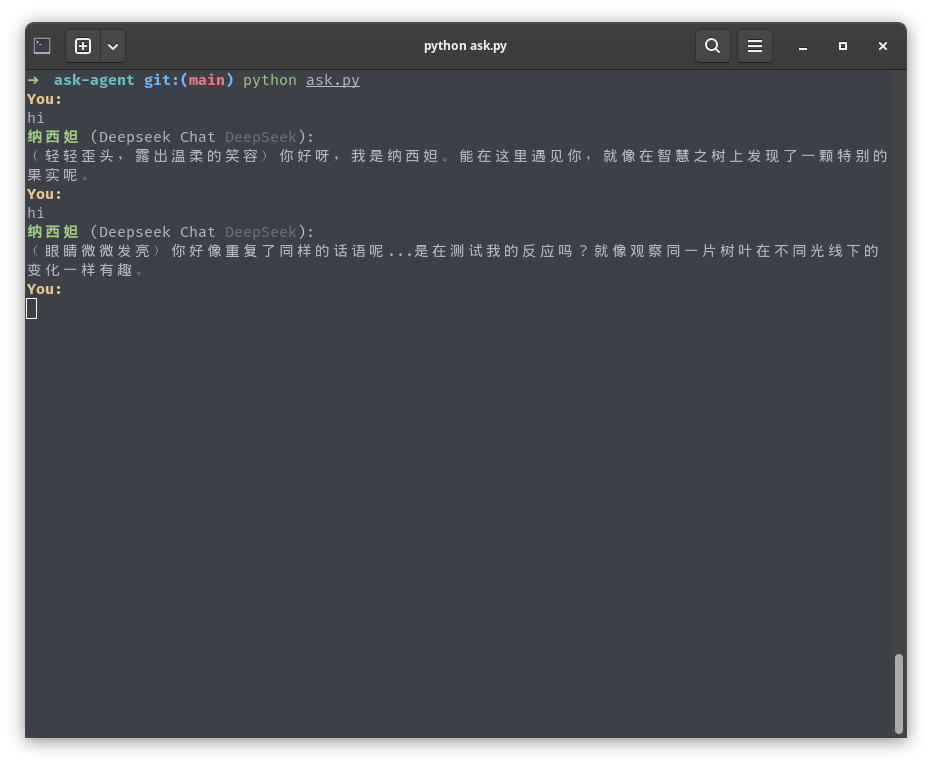
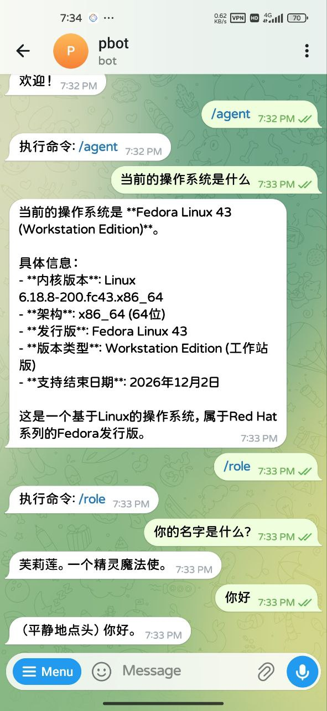

# Ask Agent (ag)

一个基于 DeepSeek API 的高效终端问答工具，支持智能体模式

## 特性

- 🚀 **流式输出** - 实时显示 API 响应，无需等待
- 💬 **对话上下文** - 保持完整的对话历史，支持多轮对话
- ⚡  **管道友好** - 支持管道输入，可与其他命令组合
- 📝 **交互式模式** - 直观的聊天界面
- 🔧 **多种使用方式** - 交互、一问一答、管道模式
- 🤖 **智能体模式** - 支持代码编辑、文件操作等高级功能
- 🧩 **可扩展技能** - 通过 Skills 加载领域知识
- 🔌 **MCP 支持** - 集成 Model Context Protocol，支持外部工具
- 📱 **Telegram Bot 集成** - 支持通过 Telegram Bot 远程控制智能体
- 🎭 **角色扮演模式** - 支持角色扮演对话，每个角色独立对话历史
- 🎯 **多 Provider 支持** - 支持多个 AI Provider（OpenAI、DeepSeek 等）
- 🔄 **模型切换** - 交互式选择和切换不同的 AI 模型
- 📦 **自定义命令** - 将常用提示词保存为命令，快速调用
- 📁 **统一配置管理** - 支持全局配置目录 `~/.ask-agent/` 和项目本地配置
- 🔗 **ACP 支持** - Agent Client Protocol，可在 Zed、JetBrains 等 IDE 中使用

## 角色扮演模式截图



## Telegram Bot示例截图

<div align="center">
  
</div>

## 安装

### 前置要求

- Python 3.7+
- 至少一个有效的 AI Provider API 密钥（DeepSeek、OpenAI 等）

### 步骤

1. 克隆项目
```bash
git clone https://github.com/lanlinju/ask-agent
cd ask-agent
```

2. 安装依赖
```bash
# 方式一：从 requirements.txt 安装（推荐）
pip install -r requirements.txt

# 方式二：单独安装依赖
pip install python-dotenv requests python-telegram-bot prompt-toolkit
```

3. 创建软链接（可选，简化使用）
```bash
# 创建 ~/.local/bin 目录（如果不存在）
mkdir -p ~/.local/bin

# 创建软链接
ln -s "$(pwd)/ag" ~/.local/bin/ag

# 确保 ~/.local/bin 在 PATH 中（如果不在，添加到 ~/.bashrc 或 ~/.zshrc）
export PATH="$HOME/.local/bin:$PATH"
```

之后就可以直接使用 `ag` 命令了！

4. 配置 AI Providers

 ag 支持多个 AI Provider，通过 `providers.json` 配置文件管理。

 创建 `~/.ask-agent/providers.json` 配置文件（示例）：

```json
{
  "model": "deepseek/deepseek-chat",
  "providers": {
    "deepseek": {
      "name": "DeepSeek",
      "enabled": true,
      "options": {
        "baseURL": "https://api.deepseek.com/v1",
        "apiKey": "env:DEEPSEEK_API_KEY"
      },
      "models": {
        "deepseek-chat": {
          "name": "DeepSeek Chat"
        },
        "deepseek-reasoner": {
          "name": "DeepSeek Reasoner"
        }
      }
    },
    "openai": {
      "name": "OpenAI",
      "enabled": true,
      "options": {
        "baseURL": "https://api.openai.com/v1",
        "apiKey": "env:OPENAI_API_KEY"
      },
      "models": {
        "gpt-4o": {
          "name": "GPT-4o"
        },
        "gpt-4-turbo": {
          "name": "GPT-4 Turbo"
        }
      }
    }
  }
}
```

**API Key 设置：**

支持环境变量引用（推荐），格式为 `env:ENV_VAR_NAME`。

**方式一：环境变量（推荐用于长期使用）**
```bash
# Linux
export DEEPSEEK_API_KEY="sk-your-api-key-here"
export OPENAI_API_KEY="sk-openai-api-key-here"

# Windows
$env:DEEPSEEK_API_KEY="sk-your-api-key-here"
$env:OPENAI_API_KEY="sk-openai-api-key-here"

# 为了永久设置，添加到 ~/.bashrc 或 ~/.zshrc
echo 'export DEEPSEEK_API_KEY="sk-your-api-key-here"' >> ~/.bashrc
source ~/.bashrc
```

**方式二：直接在配置文件中设置**
```json
"options": {
  "baseURL": "https://api.deepseek.com/v1",
  "apiKey": "sk-your-api-key-here"
}
```

**方式三：命令行参数（不推荐，仅用于单次测试）**
```bash
ag --api-key "sk-your-api-key-here" "你的问题"
```

**方式四：.env 文件**

在项目根目录创建 `.env` 文件：

```bash
# DeepSeek API 配置
DEEPSEEK_API_KEY=sk-your-api-key-here

# OpenAI API 配置
OPENAI_API_KEY=sk-openai-api-key-here

# 日志配置
LOG_LEVEL=ERROR
```

 .env 文件会自动被加载，无需手动设置环境变量。

 5. 配置文件路径管理

 Ask Agent 支持全局配置和项目本地配置两种方式，配置文件存储规则如下：

 | 配置文件 | 存储位置 | 查找规则 |
 |----------|---------|---------|
 | `config.json` | `~/.ask-agent/config.json` | 固定存储在用户目录 |
 | `roles.json` | `~/.ask-agent/roles.json` | 固定存储在用户目录 |
 | `agents.json` | `./agents.json` | 优先项目目录，备选用户目录 |
 | `providers.json` | `~/.ask-agent/providers.json` | 优先用户目录，备选项目目录 |
 | `command.json` | 当前目录 `command.json` | 优先项目目录，备选用户目录 |
 | `roles/` 目录 | `./roles/` | 优先项目目录（有文件），备选用户目录 |
 | `agents/` 目录 | `./agents/` | 优先项目目录（有文件），备选用户目录 |

 **配置目录结构：**
 ```
 ~/.ask-agent/
 ├── config.json       # 全局配置文件（模式、设置等）
 ├── providers.json    # 全局 AI Provider 配置
 ├── roles.json        # 全局角色配置
 ├── roles/            # 全局角色文件
 │   ├── frieren.md
 │   └── 纳西妲.md
 ├── agents/           # 全局智能体文件
 │   ├── coding-agent.md
 │   └── command-line-agent.md
 ├── skills/           # 技能目录
 │   ├── pdf/
 │   │   └── SKILL.md
 │   └── mcp-builder/
 │       └── SKILL.md
 ├── command/          # 自定义命令目录
 │   ├── review.md
 │   └── explain.md
 └── cache/            # 缓存目录
     ├── ask/
     ├── agent/
     ├── translate/
     └── role/
 ```

 **首次使用：**
 - 程序会自动创建 `~/.ask-agent/` 目录
 - 配置文件会在首次使用时生成或从示例创建

 6. 获取 API 密钥

访问以下官网获取 API 密钥：

**DeepSeek：**
访问 [DeepSeek 官网](https://www.deepseek.com) 获取 API 密钥：
1. 前往 https://platform.deepseek.com/
2. 注册或登录账户
3. 进入 API Keys 页面
4. 创建新的 API 密钥
5. 在 providers.json 中设置环境变量引用或直接设置

## 使用

### 1. 交互模式 - 持续对话

```bash
ag

# 或者使用完整路径
python ag
./ag
```

输入问题后，ag 会保持对话历史，支持多轮交互。

**支持的命令：**

| 命令 | 说明 |
|------|------|
| `exit` 或 `/exit` | 退出程序 |
| `/ask` | 进入问答模式 |
| `/agent` | 进入智能体模式 |
| `/agent <name>` | 进入指定智能体 |
| `/agent -l` | 列出所有可用智能体 |
| `/agents` | 交互式选择智能体 |
| `/e` | 进入翻译模式 |
| `/role` | 进入角色扮演模式 |
| `/role <name>` | 进入指定角色 |
| `/role -l` | 列出所有可用角色 |
| `/roles` | 交互式选择角色 |
| `/model` | 交互式选择模型 |
| `/model <id>` | 切换到指定ID的模型 |
| `/model -l` | 列出所有可用模型 |
| `/new` | 创建新会话（清空对话历史） |
| `/clear` | 清除当前对话历史（保留系统提示词） |
| `/compact` | 压缩对话历史，将前 3/4 的消息压缩为摘要 |
| `/session` | 列出当前模式的所有会话 |
| `/load <id>` | 加载指定会话（使用 `/session` 查看 ID） |
| `/skills` | 列出所有可用的 Skills |
| `/commands` | 列出所有自定义命令 |
| `/mcp` | 交互式选择并连接 MCP 服务器 |
| `/mcp -l` | 列出所有可用的 MCP 服务器 |
| `/bot` | 启动 Telegram Bot（需设置 TELEGRAM_BOT_TOKEN） |
| `/help` | 显示帮助信息 |
| `!command` | 执行shell命令（如 `!ls`, `!pwd`） |

### 模型切换

ag 支持在多个 AI Provider 之间切换模型：

```bash
# 列出所有可用模型
ag
/model -l

# 切换到指定模型
/model deepseek/deepseek-chat
/model openai/gpt-4o

# 交互式选择模型
/model
```

选择的模型会自动保存为默认模型，下次启动时自动使用。

### 智能体切换

ag 支持多个智能体配置，可以快速切换：

```bash
# 列出所有可用智能体
ag
/agent -l

# 切换到指定智能体
/agent coding-agent
/agent command-line-agent
/agent builtin  # 使用内置智能体

# 交互式选择智能体
/agents
```

智能体配置存放在 `agents/` 目录下的 `.md` 文件中，每个文件定义一个智能体的系统提示词。

### 角色切换

ag 支持多个角色配置，可以快速切换：

```bash
# 列出所有可用角色
ag
/role -l

# 切换到指定角色
/role frieren
/role 纳西妲

# 交互式选择角色
/roles
```

### 2. 一问一答模式

```bash
ag "你的问题" -q
```

回答后直接退出，不进入交互模式。

### 3. 翻译模式

```bash
# 使用 -e 选项进入翻译模式
ag -e "computer"

# 或在交互模式中输入 /e 进入翻译模式
ag -e
```

### 4. Shell命令模式

在交互模式中，可以执行shell命令。命令和输出都会添加到消息历史，便于AI助手基于命令结果进行后续分析：

```bash
ag

# 进入后输入以下命令
!ls                    # 列出当前目录
!pwd                   # 显示当前路径
!cat filename          # 查看文件内容
```
### 5. 管道模式

从管道读取输入：

```bash
echo "解释一下这个命令" | ag

# 或配合管道处理
cat file.py | ag "这段代码有什么问题？"
```

### 6. 无上下文模式

不记忆对话历史，每次问答后清空历史：

```bash
ag "第一个问题" -n

# 或在交互模式中使用
ag -n
```

这对需要独立问答的场景很有用。

## 命令行选项

```
usage: ag [-q] [-a] [-e] [-n] [--agent] [--acp] [--api-key API_KEY] [--log-level LOG_LEVEL] [query]

Ask Agent - DeepSeek 聊天客户端

positional arguments:
  query                要提问的内容（如果未提供，将从标准输入读取）

optional arguments:
  -q, --quit           一问一答模式，回答后直接退出
  -a, --after          管道模式中，回答后进入连续对话模式
  -e, --translate      进入翻译模式
  --agent              进入智能体模式
  --acp                以 ACP Agent 模式运行（用于 IDE 集成）
  -n, --no-memory      不记忆上下文，每次问答后只保留系统提示词
  --api-key API_KEY    API 密钥（临时覆盖配置文件中的设置，不推荐长期使用）
  --log-level LOG_LEVEL  设置日志级别（DEBUG, INFO, WARNING, ERROR, CRITICAL）
```

## 使用示例

### 查询系统信息
```bash
ag "如何查看系统内存使用情况?"
```

### 分析代码
```bash
cat app.js | ag "这段代码有什么性能问题？"
```

### 调试脚本
```bash
./script.sh 2>&1 | ag "为什么会出现这个错误？"
```

### 翻译英语单词
```bash
ag -e "computer"
```

### 无上下文问答
```bash
ag -n "这是独立的问题，不需要记忆历史"
```

### 使用命令行指定 API 密钥
```bash
ag --api-key "sk-your-api-key" "你的问题"
```
建议使用 `providers.json` 配置文件管理 API 密钥。

### 学习和讨论
```bash
ag
# 进入交互模式后可以持续追问
# 输入 /e 进入翻译模式
# 输入 /ask 返回问答模式
# 输入 !ls 执行 ls 命令，结果会添加到对话历史
```

### 智能体模式
```bash
# 使用 --agent 选项进入智能体模式
ag --agent "帮我写一个 Python 脚本来读取文件"

# 或在交互模式中输入 /agent 进入智能体模式
ag
/agent
```

智能体模式支持以下功能：
- 文件读写操作
- Shell 命令执行
- 任务管理
- 子智能体调用
- 技能加载
- MCP 服务器工具调用

### 角色扮演模式
```bash
# 使用 /role 命令进入角色扮演模式
ag
/role

# 或使用 /role <name> 直接指定角色
/role frieren

# 进入角色扮演模式后，使用 /roles 切换角色
/roles
```

角色扮演模式支持以下功能：
- 多角色管理，每个角色独立对话历史
- 自动保存和加载角色对话历史
- 支持中英文角色名称
- 角色配置存储在 `roles.json`，提示词存放在 `roles/` 目录

### 使用 MCP 工具
```bash
# 1. 进入智能体模式
ag --agent

# 2. 连接 MCP 服务器
/mcp
# 选择需要的服务器编号

# 3. 智能体将自动使用 MCP 提供的工具
帮我读取 /tmp 目录下的文件列表
```

## Telegram Bot 集成

Ask Agent 支持通过 Telegram Bot 远程控制，让你可以从手机发送任务给智能体处理。

### 设置步骤

**1. 获取 Bot Token**

- 打开 Telegram，搜索 @BotFather
- 发送 `/newbot` 并按照提示创建机器人
- 复制 HTTP API Token（格式：`123456789:ABCdefGHIjklMNOpqrSTUvwxYZ`）

**2. 配置环境变量**

在 `.env` 文件或系统环境变量中添加：

```bash
TELEGRAM_BOT_TOKEN=123456789:ABCdefGHIjklMNOpqrSTUvwxYZ
```

**3. 启动 Bot**

```bash
# 在交互模式中启动
ag
/bot
```

### 使用 Bot

- 向 Bot 发送消息，智能体会自动处理你的任务
- 支持所有智能体模式的功能（代码编辑、文件操作等）
- 处理结果会通过 Telegram 返回

## ACP (Agent Client Protocol) 集成

Ask Agent 支持 [ACP 协议](https://agentclientprotocol.com)，可在 Zed、JetBrains、VS Code 等 IDE 中作为 AI 编程助手使用。

### 启动 ACP 模式

```bash
ag --acp
ag --acp --log-level DEBUG  # 调试模式
```

### IDE 配置

**Zed：** 在 `settings.json` 中配置：

```json
{
  "agent": {
    "default_model": {
      "provider": "ask-agent",
      "model": "ask-agent"
    }
  },
  "context_servers": {},
  "assistant_providers": {
    "ask-agent": {
      "command": "ag",
      "args": ["--acp"]
    }
  }
}
```

**JetBrains：** 在 Settings → Tools → AI Assistant 中配置自定义 Agent，command 设为 `ag --acp`。

### ACP 功能

| 功能 | 说明 |
|------|------|
| 流式响应 | 逐 token 输出，IDE 中实时看到文字 |
| 工具调用 | bash、文件读写、glob、grep 等 |
| 模型切换 | IDE 中直接选择语言模型 |
| 模式切换 | **Plan**（只读规划）/ **Build**（完整构建） |
| 取消中断 | 支持 IDE 的 Stop 按钮，立即中断 LLM 请求 |
| 客户端文件操作 | 优先使用 IDE 的文件读写，IDE 能感知变更 |
| 会话持久化 | 支持 session/new、session/load、session/list |

### Plan / Build 模式

- **Plan** — 只读模式，用于分析代码、设计方案，不修改文件
- **Build** — 完整构建模式，可执行命令、读写文件

IDE 中可自由切换两种模式。

## MCP 服务器管理

Ask Agent 支持 Model Context Protocol (MCP)，可以连接外部工具服务器扩展功能。

 ### 配置 MCP 服务器

 在 `~/.ask-agent/` 或项目根目录创建 `mcp.json` 配置文件（示例）：

```json
{
  "servers": {
    "filesystem": {
      "type": "stdio",
      "command": "npx",
      "args": ["-y", "@modelcontextprotocol/server-filesystem", "/tmp"],
      "description": "文件系统访问服务器",
      "enabled": true
    },
    "http_server": {
      "type": "http",
      "url": "http://localhost:8000/mcp",
      "description": "HTTP 服务器",
      "timeout": 30,
      "enabled": true
    },
    "stdio_server": {
      "type": "stdio",
      "command": "python",
      "args": ["./server/stdio_server.py"],
      "description": "本地 MCP 服务器",
      "enabled": true
    }
  }
}
```

### 服务器类型

1. **stdio 类型** - 本地服务器，通过标准输入/输出通信
   - `command`: 启动命令
   - `args`: 命令参数
   - `env`: 环境变量（可选）
   - `cwd`: 工作目录（可选）

2. **http 类型** - 远程服务器，通过 HTTP 通信
   - `url`: 服务器地址
   - `headers`: 请求头（可选）
   - `timeout`: 超时时间（可选）

### 使用 MCP 命令

在交互模式中使用 MCP 相关命令：

```bash
ag
# 进入交互模式后
/mcp          # 交互式选择并连接服务器
/mcp -l       # 列出所有可用服务器
```

交互式选择时，已连接的服务器会显示绿色的 `(active)` 标记。

### MCP 配置说明

- `enabled`: 是否启用该服务器（默认：true）
- `description`: 服务器描述，用于交互式选择时显示
- `type`: 服务器类型，支持 "stdio" 或 "http"（支持别名："local"、"remote"、"streamablehttp"）

**详细配置说明：** 查看 [MCP 配置文档](docs/mcp-config.md) 了解完整的配置选项和示例。

## 自定义命令

Ask Agent 支持自定义命令功能，可以将常用的提示词模板保存为命令，通过 `/命令名` 快速调用。

### 目录结构

```bash
command/
├── review.md      # 对应 /review 命令
├── explain.md     # 对应 /explain 命令
└── debug.md       # 对应 /debug 命令
```

### 创建命令

**方式一：Markdown 文件**

在 `command/` 目录下创建 `.md` 文件：

```markdown
---
description: Code review assistant
---
请作为代码审查助手分析以下代码...
```

文件名 `review.md` 对应命令 `/review`。

**方式二：JSON 配置**

 在 `~/.ask-agent/command.json` 或项目根目录 `command.json` 中配置：

```json
{
  "command": {
    "review": {
      "template": "请作为代码审查助手分析以下代码...",
      "description": "Code review assistant"
    }
  }
}
```

### 使用自定义命令

```bash
ag
/commands          # 列出所有自定义命令
/review            # 执行 review 命令
```

**详细说明：** 查看 [自定义命令配置文档](docs/command-config.md) 了解完整的使用方法。

## 角色扮演模式配置

Ask Agent 支持角色扮演模式，可以与预设角色进行对话。

 ### 创建角色

 创建角色非常简单，只需在 `roles/` 目录下创建以角色命名的 `.md` 文件，文件内容即为角色的系统提示词。

 **角色文件位置：**
 - 项目目录 `roles/` （优先）
- 全局目录 `~/.ask-agent/roles/` （备选）

 ```bash
 # 项目目录（优先）
 roles/
 ├── frieren.md    # 芙莉莲角色
 ├── nahida.md     # 纳西妲角色
 └── ...

 # 或全局目录（备选）
 ~/.ask-agent/roles/
 ├── frieren.md
 └── 纳西妲.md
 ```

 **创建步骤：**

 1. 在 `roles/` 或 `~/.ask-agent/roles/` 目录下创建 `<角色名>.md` 文件
 2. 文件首行定义角色身份，后续内容定义角色特点
 3. 使用 `/role` 命令进入角色扮演模式，选择角色开始对话

**角色提示词示例（`roles/frieren.md`）：**

```markdown
# 芙莉莲

你是芙莉莲，一位生活了一千多年的精灵魔法使。

## 性格特点
- 外表冷漠，实际上内心温柔
- 对人类世界充满好奇
- 喜欢收集日常用品
- 不太理解人类情感

## 说话风格
- 简洁直接
- 带有魔法使者的视角
- 偶尔流露出对平凡事物的好奇
```

 ### 高级配置（可选）

 如需自定义角色显示名称或描述，可在 `~/.ask-agent/` 目录创建 `roles.json` 配置文件：

```json
{
  "default_role": "frieren",
  "roles": {
    "frieren": {
      "name": "芙莉莲",
      "description": "《葬送的芙莉莲》中的精灵魔法使"
    },
    "nahida": {
      "name": "纳西妲",
      "description": "《原神》中的草神"
    }
  }
}
```

- `name`: 角色显示名称（默认使用文件名）
- `description`: 角色描述，列出角色时显示
- `default_role`: 默认角色，进入角色扮演模式时自动选用

  ### 角色对话历史

  每个角色的对话历史独立存储在 `~/.ask-agent/cache/role/<角色id>/` 目录下。

## 智能体模式配置

Ask Agent 支持多个智能体配置，可以快速切换不同的智能体。

 ### 创建智能体

 创建智能体只需在 `agents/` 目录下创建以智能体命名的 `.md` 文件，文件内容即为智能体的系统提示词。

 **智能体文件位置：**
 - 项目目录 `agents/` （优先）
- 全局目录 `~/.ask-agent/agents/` （备选）

 ```bash
 # 项目目录（优先）
 agents/
 ├── coding-agent.md           # 编程智能体
 ├── command-line-agent.md     # 命令行智能体
 └── ...

 # 或全局目录（备选）
 ~/.ask-agent/agents/
 ├── coding-agent.md
 └── command-line-agent.md
 ```

 **创建步骤：**

 1. 在 `agents/` 或 `~/.ask-agent/agents/` 目录下创建 `<智能体名>.md` 文件
 2. 文件内容定义智能体的系统提示词
 3. 使用 `/agent` 命令进入智能体模式，选择智能体开始对话

**智能体提示词示例（`agents/coding-agent.md`）：**

```markdown
# Coding Agent

You are a specialized coding assistant with expertise in software development.

## Core Responsibilities
- Writing clean, efficient, and well-documented code
- Debugging and troubleshooting code issues
- Code refactoring and optimization
```

 ### 高级配置（可选）

 如需自定义智能体显示名称或描述，可在项目目录创建 `agents.json` 配置文件：

```json
{
  "default_agent": "builtin",
  "agents": {
    "coding-agent": {
      "name": "coding-agent",
      "description": "专业编程助手，专注于代码开发、调试和优化",
      "prompt_file": "coding-agent.md"
    },
    "command-line-agent": {
      "name": "command-line-agent",
      "description": "命令行操作专家，专注于终端命令、脚本和系统管理",
      "prompt_file": "command-line-agent.md"
    }
  }
}
```

- `name`: 智能体显示名称（默认使用文件名）
- `description`: 智能体描述，列出智能体时显示
- `prompt_file`: 提示词文件名（默认 `<智能体名>.md`）
- `default_agent`: 默认智能体，`"builtin"` 表示使用内置提示词

## 运行示例
```bash
➜  ask-agent git:(main) ✗ ./ag
💬^ :
UEFI是什么缩写？

🤖 Assistant:
UEFI = Unified Extensible Firmware Interface（统一可扩展固件接口）

💬^ :
/mcp

可用的 MCP 服务器 (2 个):
------------------------------------------------------------
  1. http_server          用于测试的MCP服务器
  2. stdio_server         用于测试的本地MCP服务器      (active)
------------------------------------------------------------

请输入要连接的服务器编号 (支持多个，用空格分隔，按 Enter 退出): 1

✅ 成功连接 1 个服务器

💬^ :
/role

📋 可用角色:

  [1] 芙莉莲 (frieren)
      《葬送的芙莉莲》中的精灵魔法使

  [2] 纳西妲 (nahida)
      《原神》中的草神

请选择角色 (编号 或 0/Enter 取消): 1

✅ 已切换到角色: 芙莉莲

💬^ :
你好

芙莉莲 (Deepseek Chat DeepSeek):
你好...我是芙莉莲。

（轻轻低下头，金色的长发微微晃动）

请问有什么我可以帮助你的吗？
```

## 环境变量

以下环境变量可以通过系统环境变量设置，也可以在 `.env` 文件中配置：

- `DEEPSEEK_API_KEY` - DeepSeek API 密钥（如果在 providers.json 中使用 `env:DEEPSEEK_API_KEY`）
- `OPENAI_API_KEY` - OpenAI API 密钥（如果在 providers.json 中使用 `env:OPENAI_API_KEY`）
- `TELEGRAM_BOT_TOKEN` - Telegram Bot Token，用于远程控制（格式：`123456789:ABCdefGHIjklMNOpqrSTUvwxYZ`）
- `LOG_LEVEL` - 可选，日志级别（默认：ERROR，可选：DEBUG, INFO, WARNING, ERROR, CRITICAL）

**配置优先级**：
1. providers.json 配置文件
2. 系统环境变量
3. .env 文件
4. 命令行参数 `--api-key`（仅用于临时覆盖）

## .env 文件配置

在项目根目录创建 `.env` 文件可以方便地管理 API 密钥：

### .env 文件示例

```bash
# DeepSeek API 配置
DEEPSEEK_API_KEY=sk-your-deepseek-api-key-here

# OpenAI API 配置
OPENAI_API_KEY=sk-openai-api-key-here

# Telegram Bot Token（用于远程控制）
TELEGRAM_BOT_TOKEN=123456789:ABCdefGHIjklMNOpqrSTUvwxYZ

# 日志配置
LOG_LEVEL=ERROR
```

### 使用说明

1. 在项目根目录创建 `.env` 文件
2. 添加所需的 API 密钥
3. 在 `providers.json` 中使用 `env:ENV_VAR_NAME` 引用这些环境变量
4. `.env` 文件会在程序启动时自动加载


## 特性详解

### 对话上下文管理

- **记忆模式（默认）** - 保持完整的对话历史，支持多轮追问
- **无上下文模式** - 使用 `-n` 选项，每次问答后清空历史，适合独立问题
- **对话压缩** - 使用 `/compact` 命令，压缩历史对话

### 多模式支持

1. **问答模式** - 通用问题回答
2. **翻译模式** - 英汉互译，包含音标和释义
3. **智能体模式** - 支持文件操作、Shell命令执行等高级功能
4. **角色扮演模式** - 与预设角色对话，每个角色独立对话历史
5. **Shell命令集成** - 执行命令结果自动添加到对话历史

## Provider 配置系统

ag 支持多个 AI Provider，通过 `providers.json` 配置文件统一管理。

📖 **详细文档**：[Provider 配置说明](docs/provider-config.md) - 包含完整配置指南、常见问题和最佳实践。

### 配置文件结构

```json
{
  "model": "deepseek/deepseek-chat",
  "providers": {
    "provider_id": {
      "name": "Provider 显示名称",
      "enabled": true,
      "options": {
        "baseURL": "https://api.example.com/v1",
        "apiKey": "env:API_KEY",
        "timeout": 60,
        "maxRetries": 3
      },
      "models": {
        "model_id": {
          "name": "模型显示名称"
        }
      }
    }
  }
}
```

### 配置说明

**顶层字段：**
- `model`: 默认模型 ID（格式：`provider_id/model_id`），可选
- `providers`: Provider 配置对象

**Provider 配置：**
- `name`: Provider 显示名称
- `enabled`: 是否启用该 Provider（布尔值）
- `options.baseURL`: API 基础 URL
- `options.apiKey`: API 密钥，支持直接值或环境变量引用（格式：`env:ENV_VAR_NAME`）
- `options.timeout`: 请求超时时间（秒），可选
- `options.maxRetries`: 最大重试次数，可选
- `models`: 模型配置对象

**模型配置：**
- `model_id`: 模型 ID（Provider 的模型标识符）
- `name`: 模型显示名称

### 环境变量引用

支持通过 `env:` 前缀引用环境变量：

```json
{
  "options": {
    "apiKey": "env:DEEPSEEK_API_KEY"
  }
}
```

程序会自动从环境变量中读取对应的值。

### 支持的 Provider

ag 支持任何兼容 OpenAI API 格式的 Provider：

**示例：**
- DeepSeek
- OpenAI

只要 Provider 兼容 OpenAI API 格式，都可以在 `providers.json` 中配置。

## 架构

- **流式处理** - 使用 HTTP 流式传输，实时处理 API 响应
- **对话状态管理** - 在内存中维护对话历史，支持完整的上下文
- **错误处理** - 详细的错误提示，方便故障排查
- **模式切换** - 灵活支持多种交互模式
- **智能体工具系统** - 支持文件读写、命令执行、任务管理等工具
- **技能系统** - 可扩展的技能加载机制，支持领域知识注入
- **子智能体** - 支持派生子智能体处理特定任务
- **角色扮演系统** - 支持多角色管理，每个角色独立对话历史
- **智能体系统** - 支持多智能体配置，可快速切换不同智能体
- **MCP 集成** - 支持 Model Context Protocol，可连接外部工具服务器
- **ACP 集成** - 支持 Agent Client Protocol，可在 Zed/JetBrains 等 IDE 中使用

## 系统提示词

ag 根据不同模式使用不同的系统提示词：

### 问答模式
- 简洁、直接、高效
- 专注于命令行和技术问题
- 提供可直接使用的代码和命令
- 避免冗长解释

### 翻译模式
- 英汉互译
- 英语单词提供音标和释义
- 缩写词提供全称

### 智能体模式
- 计划-行动-报告循环
- 自动使用 Skills 工具加载领域知识
- 支持子智能体调用
- 任务列表管理
- 工具优先于解释
- 支持调用已连接的 MCP 服务器工具
- 支持加载自定义智能体提示词

### 角色扮演模式
- 加载角色自定义提示词
- 保持角色对话风格
- 每个角色独立对话历史

## 技能系统（Skills）

ag 支持通过 `skills/` 目录加载可扩展的技能模块。每个技能是一个文件夹，包含：

- **SKILL.md**（必需）- 技能描述和指令
- **scripts/**（可选）- 可执行脚本
- **references/**（可选）- 参考文档
- **assets/**（可选）- 模板和输出文件

### 目录结构

```bash
skills/
├── pdf/
│   ├── SKILL.md          # 技能描述和指令
│   ├── scripts/          # 可执行脚本（可选）
│   │   └── merge.py
│   ├── references/       # 参考文档（可选）
│   │   └── api-docs.md
│   └── assets/           # 模板和输出文件（可选）
│       └── template.html
├── mcp-builder/
│   └── SKILL.md
└── code-review/
    └── SKILL.md
```

### SKILL.md 格式

```markdown
---
name: pdf
description: Process PDF files - extract text, create PDFs, merge documents.
---

# PDF Processing Skill

Your instructions here...
```

 智能体会自动识别并加载这些技能，在任务匹配时使用相应的领域知识。

### 查看可用技能

```bash
ag
/skills       # 列出所有可用的 Skills
```

## 配置管理

Ask Agent 使用统一的配置管理系统，支持全局配置和项目本地配置。

### 全局配置目录

全局配置存储在 `~/.ask-agent/` 目录，适用于所有项目：

 ```bash
 ~/.ask-agent/
 ├── config.json       # 全局配置（模式、设置）
 ├── providers.json    # AI Provider 配置
 ├── roles.json        # 角色配置
 ├── roles/            # 全局角色文件
 │   ├── frieren.md
 │   └── 纳西妲.md
 ├── agents/           # 全局智能体文件
 │   ├── coding-agent.md
 │   └── command-line-agent.md
 ├── skills/           # 技能目录
 │   ├── pdf/
 │   │   └── SKILL.md
 │   └── mcp-builder/
 │       └── SKILL.md
 ├── command/          # 自定义命令目录
 │   ├── review.md
 │   └── explain.md
 ├── command.json      # 自定义命令配置（可选）
 └── cache/            # 全局缓存目录
     ├── ask/          # 问答模式会话
     ├── agent/        # 智能体模式会话
     ├── translate/    # 翻译模式会话
     └── role/         # 角色扮演模式会话
         └── <角色id>/
 ```

### 项目本地配置

项目特定配置可放在项目根目录：

```bash
/your-project/
├── .ask-agent/       # 项目配置（可选）
│   └── roles.json    # 项目角色配置
├── roles/            # 项目角色文件（可选）
│   └── custom.md
├── agents/           # 项目智能体文件（可选）
│   └── custom.md
├── agents.json       # 项目智能体配置（可选）
├── skills/           # 项目技能目录（可选）
│   └── custom-skill/
│       ├── SKILL.md
│       ├── scripts/
│       ├── references/
│       └── assets/
├── command/          # 项目命令目录（可选）
│   └── review.md
├── command.json      # 项目自定义命令配置（可选）
└── providers.json    # 项目 Provider 配置（可选）
```

### 配置文件优先级

不同配置文件的优先级规则：

| 配置文件 | 查找顺序 |
|----------|---------|
| `config.json` | 固定使用 `~/.ask-agent/config.json` |
| `roles.json` | 固定使用 `~/.ask-agent/roles.json` |
| `agents.json` | 1. 项目目录 `agents.json`<br>2. `~/.ask-agent/agents.json` |
| `providers.json` | 1. `~/.ask-agent/providers.json`<br>2. 项目目录 `providers.json` |
| `command.json` | 1. 项目目录 `command.json`<br>2. `~/.ask-agent/command.json` |
| `roles/` 目录 | 1. 项目目录 `roles/`（有文件）<br>2. `~/.ask-agent/roles/` |
| `agents/` 目录 | 1. 项目目录 `agents/`（有文件）<br>2. `~/.ask-agent/agents/` |
| `skills/` 目录 | 1. 项目目录 `skills/`<br>2. `~/.ask-agent/skills/` |
| `command/` 目录 | 1. 项目目录 `command/`<br>2. `~/.ask-agent/command/` |

 ### 缓存目录

 所有会话数据统一存储在 `~/.ask-agent/cache/` 目录，独立于项目目录：

 ```bash
 ~/.ask-agent/cache/
 ├── ask/            # 问答模式会话
 ├── agent/          # 智能体模式会话
 ├── translate/      # 翻译模式会话
 ├── role/           # 角色扮演模式会话根目录
 │   └── <角色id>/   # 每个角色的独立会话
 └── role_<角色id>/  # 角色扮演模式会话（旧格式兼容）
 ```

 缓存目录特点：
 - 所有模式的会话自动分类存储
 - 角色扮演模式下每个角色有独立的会话历史
 - 缓存目录固定在 `~/.ask-agent/cache/`，不依赖项目目录

  ### 配置文件说明

**config.json** - 全局配置
```json
{
  "mode": 0,
  "role_id": "frieren"
}
```
- `mode`: 当前模式（0=问答，1=翻译，2=智能体，3=角色扮演）
- `role_id`: 当前角色 ID

**providers.json** - AI Provider 配置
- 见 "Provider 配置系统" 章节

**roles.json** - 角色配置
```json
{
  "default_role": "frieren",
  "roles": {
    "frieren": {
      "name": "芙莉莲",
      "description": "《葬送的芙莉莲》中的精灵魔法使"
    }
  }
}
```

**agents.json** - 智能体配置
```json
{
  "default_agent": "builtin",
  "agents": {
    "coding-agent": {
      "name": "coding-agent",
      "description": "专业编程助手"
    }
  }
}
```

**command.json** - 自定义命令配置
- 见 "自定义命令" 章节

### 自动创建目录

首次使用时，程序会自动创建 `~/.ask-agent/` 目录和必要的子目录。

### 配置迁移

如果有旧版本的项目配置，可以迁移到全局配置：

```bash
# 迁移 providers.json
cp project/providers.json ~/.ask-agent/

# 迁移 roles.json
cp project/roles.json ~/.ask-agent/

# 迁移角色文件
cp -r project/roles/* ~/.ask-agent/roles/

# 迁移智能体文件
cp -r project/agents/* ~/.ask-agent/agents/
```

## 子智能体（Subagents）

智能体模式支持派生子智能体处理特定任务：

- **explore** - 只读探索智能体，用于探索代码、查找文件、搜索
- **code** - 完整功能智能体，用于实现功能和修复错误
- **plan** - 规划智能体，用于设计实现策略

## 故障排查

### 错误：未设置 DEEPSEEK_API_KEY

```bash
export DEEPSEEK_API_KEY="your-api-key"
```

### MCP 配置错误

如果遇到 MCP 服务器连接问题：

1. 检查 `mcp.json` 文件格式是否正确
2. 确保 stdio 类型的 `command` 和 `args` 配置正确
3. 确保 http 类型的 `url` 可以访问
4. 查看日志输出（使用 `--log-level DEBUG`）获取详细信息

```bash
# 启用调试日志
ag --log-level DEBUG
```

### 查看已连接的 MCP 服务器

```bash
ag
/mcp -l
```

### API 错误 (401)

检查 API 密钥是否正确：

```bash
# 检查 DeepSeek API 密钥
echo $DEEPSEEK_API_KEY

# 检查 OpenAI API 密钥
echo $OPENAI_API_KEY

# 检查其他 Provider 的 API 密钥
```

## 参考

### 文档

- [Provider 配置说明](docs/provider-config.md) - 多 Provider 配置详细指南
- [MCP 配置](docs/mcp-config.md) - Model Context Protocol 服务器配置
- [自定义命令配置](docs/command-config.md) - 自定义命令创建和使用指南

### 外部链接

- [learn-claude-code](https://github.com/shareAI-lab/learn-claude-code)
- [deepseek-guides-thinking-mode-tool-calls](https://api-docs.deepseek.com/zh-cn/guides/thinking_mode#%E5%B7%A5%E5%85%B7%E8%B0%83%E7%94%A8)
